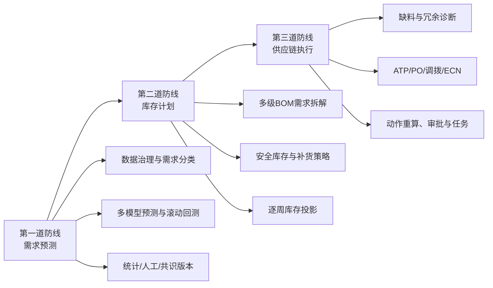
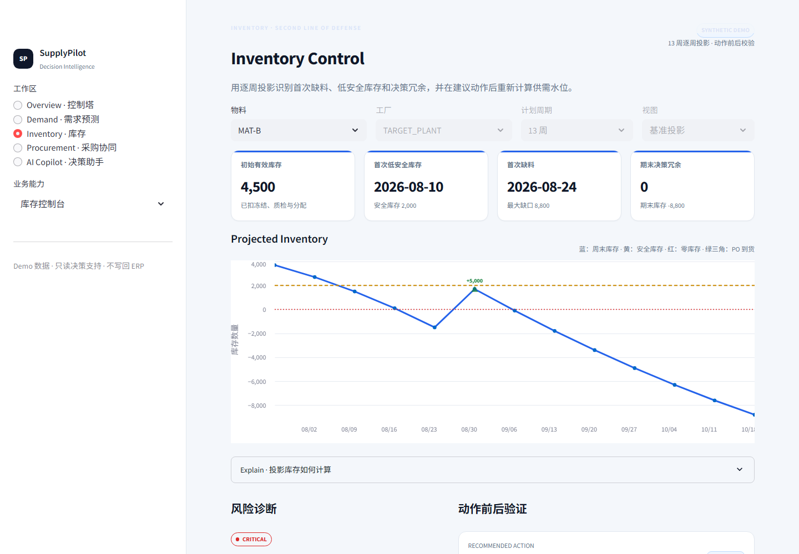
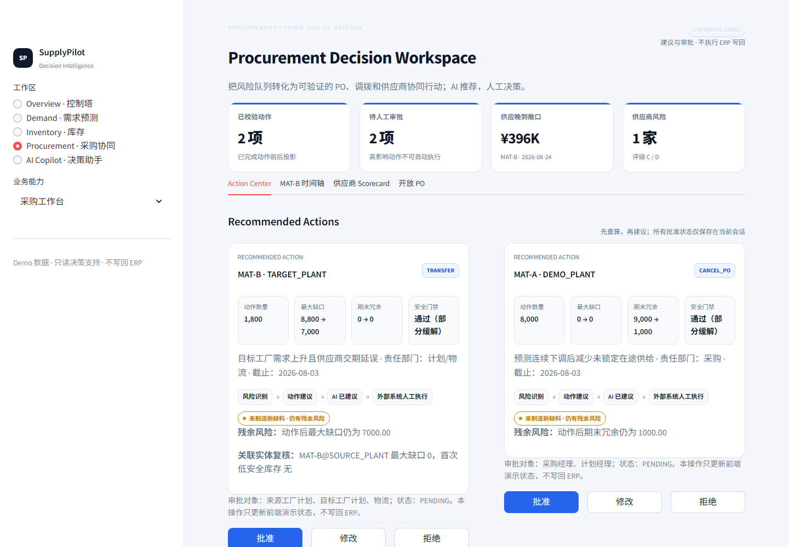
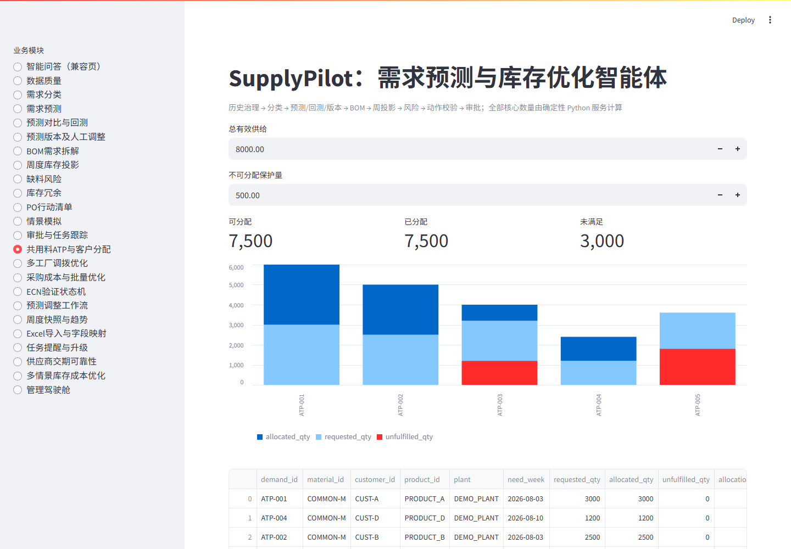
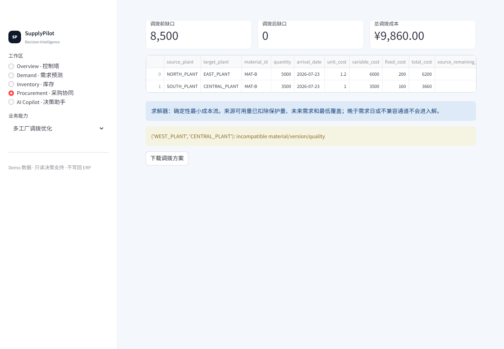
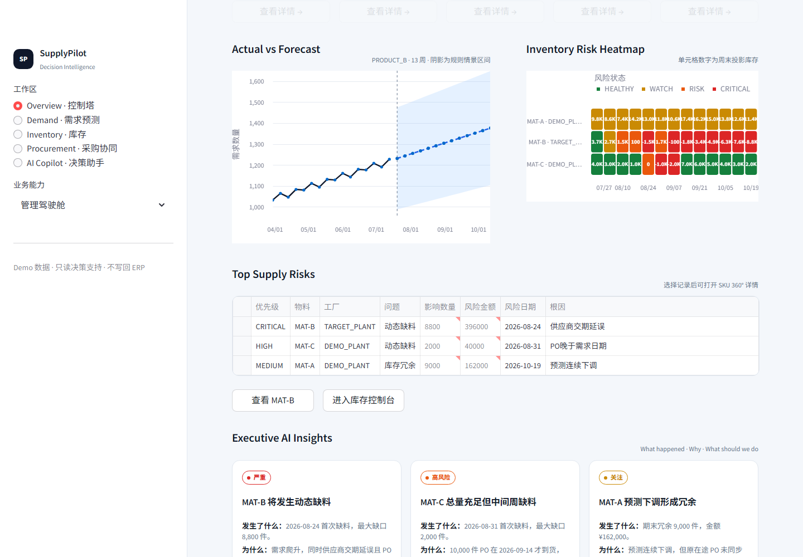
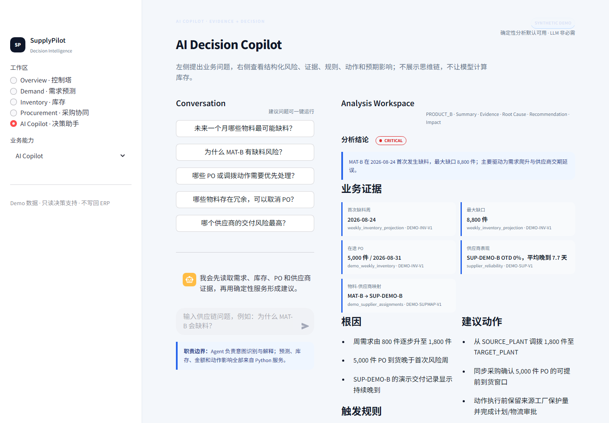
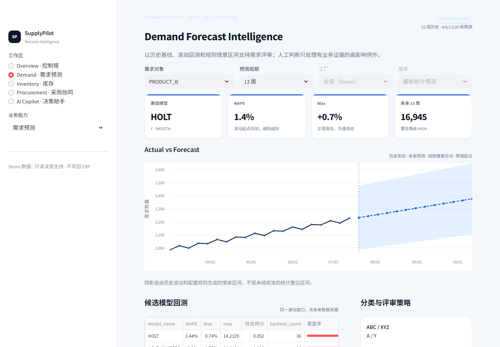
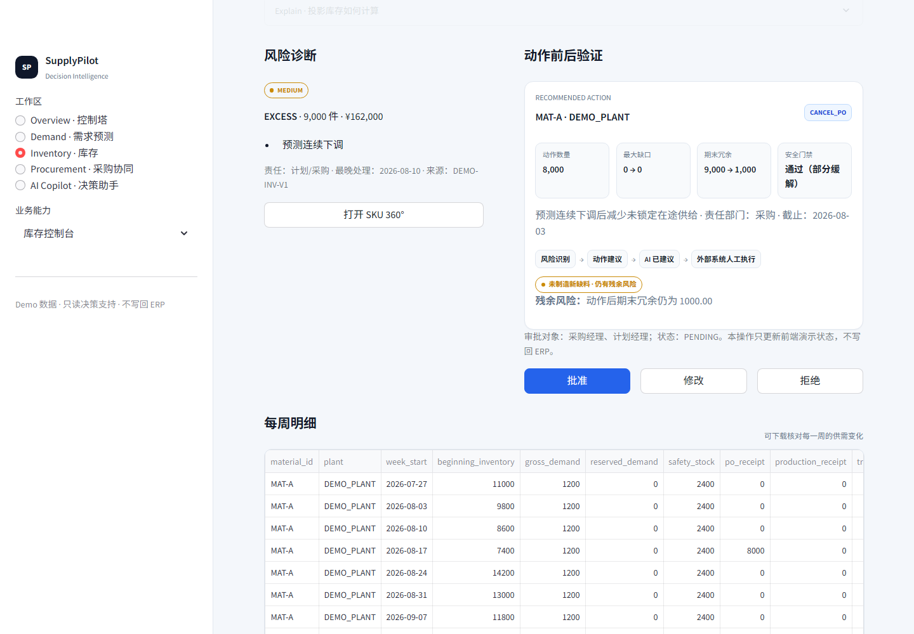
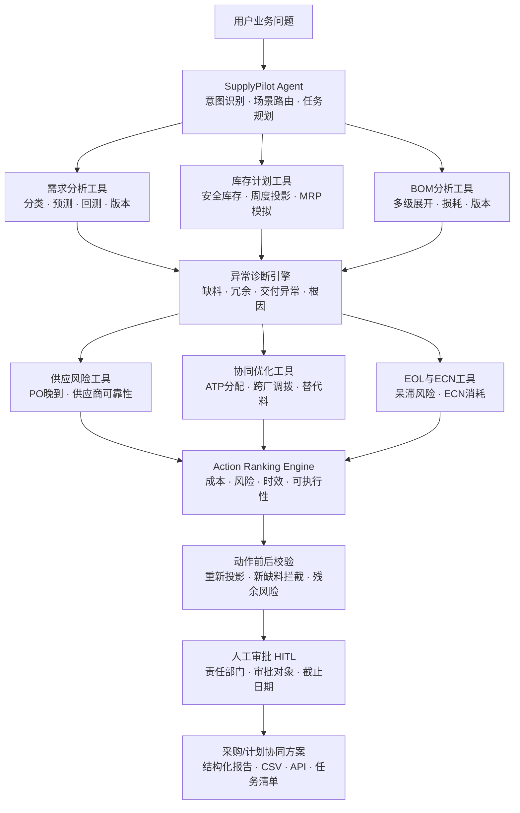

# SupplyPilot：供应链计划与采购协同智能体

[](https://www.python.org/)
[](https://fastapi.tiangolo.com/)
[](https://streamlit.io/)
[](tests/)
[](data/)
[](LICENSE)

面向制造业计划、库存与采购协同场景，将**需求预测、多级BOM、周度库存投影、缺料与冗余诊断、ATP分配、多工厂调拨、采购优化和审批跟踪**汇集到一个可下钻的供应链控制塔，并由AI Copilot按“结论—证据—根因—动作—影响”组织决策说明。

> 设计边界：LLM只负责语言理解与表达辅助；所有预测、库存、BOM、数量、金额、风险分级和动作前后结果均由确定性Python服务计算。PO取消、跨厂调拨、替代料和ECN等高影响动作只生成建议与审批信息，不自动写回ERP。

## 交互式案例演示

想先看项目能解决什么业务问题，可以从这里开始：
- [GitHub 在线展示地址](https://lxingwei81-ux.github.io/supplypilot-agent/)：当前已部署可访问；8个可点击案例覆盖中间周缺料、需求下降消冗、共用料ATP、多工厂调拨、采购批量优化、预测调整FVA、ECN旧料消耗和供应商交付风险。
- 每个案例都把**业务场景、计算公式、规则约束、方法步骤、动作前后校验**放在同一页，方便招聘方或评审快速理解项目价值

## 五大工作区

| 工作区 | 回答的问题 | 核心界面 |
|---|---|---|
| **Overview** | 现在最需要处理什么 | KPI、需求趋势、库存风险热力图、风险队列、AI洞察、行动中心 |
| **Demand Forecast** | 未来需求是多少、模型是否可信 | Actual vs Forecast、情景上下限、滚动回测、版本与人工调整 |
| **Inventory** | 哪一周缺料、哪里形成冗余 | BOM拆解、周度库存投影、安全库存、缺料/冗余与情景模拟 |
| **Procurement** | 哪个PO、工厂或供应商需要协同 | PO动作、ATP、跨厂调拨、采购优化、供应商可靠性与审批任务 |
| **AI Copilot** | 为什么发生、建议做什么 | 结构化摘要、证据、根因、建议动作、预期影响、规则与限制 |

## 文档导航

- [公式与规则手册](docs/FORMULA_CATALOG.md)
- [智能体与技术架构](docs/AGENT_ARCHITECTURE.md)
- [业务案例库](docs/cases/README.md)
- [业务场景规格](docs/BUSINESS_SCENARIO_SPEC.md)
- [数据字典](docs/DATA_DICTIONARY.md)
- [GitHub发布检查清单](docs/GITHUB_RELEASE_CHECKLIST.md)

## 30秒看懂项目

SupplyPilot按照供应链“三道防线”组织能力：第一道防线提高需求基线质量，第二道防线用库存吸收剩余不确定性，第三道防线只处理真正的执行例外。



系统完成的闭环：


## 项目能力

| 业务问题 | 确定性能力 | 关键输出 |
|---|---|---|
| 历史数据是否可信 | 必填、日期、数值、重复记录、BOM循环、版本断档检查 | 阻断项、警告、数据限制 |
| 应该使用哪类预测方法 | ABC/XYZ、ADI-CV²、生命周期分类 | 需求标签、候选模型、库存策略 |
| 未来需求是多少 | 11类基础预测模型＋EOL DECAY衰减策略、4/8/13/26周预测、滚动起点回测 | WAPE、Bias、MAE、模型得分、置信度 |
| 人工调整是否有效 | 统计/调整/共识版本和FVA | 审批记录、调整证据、FVA状态 |
| 成品需求如何转换为物料需求 | 任意层级BOM递归、版本有效期、损耗和单位换算 | 物料、周次、BOM路径、毛需求 |
| 哪一周会缺料 | 可用库存与逐周库存状态递推 | 首次缺料周、最大缺口、覆盖周数 |
| 哪些库存是真正冗余 | 预测需求、安全库存、保留需求和在途供给联合计算 | 冗余数量、金额、形成原因 |
| 共用料不足时如何分配 | 冻结订单、客户优先级、停线损失、紧迫度规则 | 请求量、分配量、未满足量、分配原因 |
| 能否从其他工厂调拨 | 来源保护量、通道兼容、到货时限、最小成本流 | 来源/目标、调拨量、到货日、成本、残余缺口 |
| 哪些PO可以取消或延期 | 取消窗口、锁定量、MPQ、罚金、持有和过时成本 | 单据级调整量、罚金、避免成本、剩余冗余 |
| 如何选择补货批量 | MOQ、MPQ、包装倍数、价格阶梯联合枚举 | 建议数量、适用单价、总成本、期末缺口/盈余 |
| 动作是否会制造新问题 | 内存应用动作并重跑周度投影 | 动作前后对比、拒绝原因、残余风险、审批要求 |

完整公式、变量、边界条件和代码位置见[《公式与规则手册》](docs/FORMULA_CATALOG.md)。

## 关键公式

### 周度库存投影

```text
第t周期末库存 = 第t周期初库存 + 第t周PO到货 + 第t周生产入库
              + 第t周调入 - 第t周毛需求 - 第t周保留需求 - 第t周调出
```

逐周递推而不是只计算“库存＋PO－总需求”，因此能够识别总量充足但中间周缺料的时序风险。

### 冗余库存

```text
第t周冗余数量 = 若“第t周期末库存 - 第t周安全库存”大于0，则取该差值；否则为0
```

业务上将其解释为：满足预测/保留需求并保留必要安全缓冲后，仍超出需求的库存。冗余金额为：

```text
第t周冗余金额 = 第t周冗余数量 × 单位成本
```

### 安全库存

```text
安全库存 = 服务水平系数 × √(平均交期 × 需求方差 + 平均需求² × 交期方差)
```

安全库存吸收需求与交期的不确定性，不用于掩盖虚高预测或不稳定的执行流程。

### 多级BOM毛需求

```text
某物料第t周毛需求 = Σ(成品第t周预测需求 × 该成品到该物料的累计单位用量)
```

其中累计用量逐层叠加单位用量、单位换算和损耗。

### 预测情景上下限

```text
悲观下限 = 若“基准预测 × (1 - 波动带宽)”小于0，则取0；否则取该结果
乐观上限 = 基准预测 × (1 + 波动带宽)
```

`波动带宽`由历史波动率和`rules.yaml`中的倍率、下限规则确定。它用于比较基准、乐观和悲观情景，**不是经过概率校准的统计置信区间**，不能解释为“真实需求有95%概率落在区间内”。

## 三个重点案例

### 1. 总量不缺，但中间周缺料

静态算法显示未来总供应比总需求多2,000，但PO到货时间过晚。逐周投影发现：

| 指标 | 结果 |
|---|---:|
| 静态总量盈余 | 2,000 |
| 首次缺料周 | 2026-08-31 |
| 最大缺口 | 2,000 |
| 提前4,000 PO后的最大缺口 | 0 |



结论：静态总量不能替代时间维度投影。运行案例：

```powershell
python examples/run_cases.py --case 3
```

[查看完整案例](docs/cases/03-middle-week-shortage.md)

### 2. 需求下降导致库存冗余

产品周需求从1,000下降到600，经BOM拆解和周度投影，识别MAT-A期末决策冗余9,000。模拟取消8,000在途PO后：

| 指标 | 动作前 | 动作后 |
|---|---:|---:|
| 期末冗余 | 9,000 | 1,000 |
| 新增缺料 | — | 否 |
| 建议执行 | — | 是，需审批 |



系统继续检查共用消耗、跨厂调拨和ECN消耗机会；PO取消、调拨和ECN均只生成建议，不自动写回业务系统。

```powershell
python examples/run_cases.py --case 1
python examples/run_phase2_cases.py --case 3
```

[查看完整案例](docs/cases/01-demand-decline-excess.md)

### 3. 共用料竞争与多工厂调拨

ATP先扣除保护量，再按冻结订单、客户优先级、缺货损失、需求紧迫度和生命周期进行可追溯分配。



调拨优化只使用不影响来源工厂未来需求和最低覆盖的库存，并排除不兼容或无法按时到达的通道。Demo中调拨前缺口8,500，优化后缺口为0，总调拨成本9,860。



```powershell
python examples/run_phase2_cases.py --case 1
python examples/run_phase2_cases.py --case 2
```

[查看ATP案例](docs/cases/06-shared-material-atp.md) · [查看调拨案例](docs/cases/07-cross-plant-transfer.md)

## 页面预览

| 库存风险热力图 | AI Copilot结构化决策 |
|---|---|
|  |  |

| Actual vs Forecast | 动作前后校验 |
|---|---|
|  |  |

Streamlit以五个主工作区组织原有能力，覆盖数据质量、需求分类、预测/回测、预测版本、BOM、库存投影、风险、采购动作、ATP、调拨、ECN、任务和控制塔。控制塔的KPI、热力图、洞察卡片和Copilot共用同一份`ControlTowerSnapshot`，避免同屏指标口径不一致。

## 智能体业务编排架构




架构原则：

- 规则优先、LLM辅助，不让大模型编造业务数量；
- 预测、风险和动作保留数据版本、规则版本、证据和计算时间；
- 数据存在阻断问题时停止依赖该数据的计算；
- 高影响动作必须重新投影并保留人工审批；
- 相同输入产生相同结果，便于测试、审计和复现。

详细说明见[《智能体与技术架构》](docs/AGENT_ARCHITECTURE.md)。

## 快速运行

要求Python 3.11+。

```powershell
git clone https://github.com/lxingwei81-ux/supplypilot-agent.git
cd supplypilot_agent_v2
python -m venv .venv
.\.venv\Scripts\Activate.ps1
python -m pip install -r requirements.txt
python -m streamlit run app.py
```

浏览器打开 `http://localhost:8501`。五大工作区以及结构化AI Copilot的Demo均可在无OpenAI API Key时运行；Copilot的数字与动作影响来自确定性控制塔快照，不调用大模型进行数量计算。

如需单独启用兼容的OpenAI Agents SDK自然语言编排能力：

```powershell
Copy-Item .env.example .env
# 在本地.env中配置OPENAI_API_KEY，不要提交.env
```

### 运行API

```powershell
python -m uvicorn src.api:app --reload
```

接口文档：`http://127.0.0.1:8000/docs`

控制塔与结构化Copilot接口：

```text
GET  /v3/control-tower?selected_product_id=PRODUCT_B
POST /v3/copilot/structured
```

### 运行案例

```powershell
python examples/run_cases.py --case all
python examples/run_phase2_cases.py --case all
```

案例导航见[《业务案例库》](docs/cases/README.md)。

### 一键同步到GitHub

首次发布完成后，可使用仓库内脚本执行“测试 → 敏感文件检查 → 提交 → 拉取 → 推送”：

```powershell
powershell -ExecutionPolicy Bypass -File scripts/sync_github.ps1 `
    -Message "docs: update cases and screenshots"
```

脚本只为当前进程继承Windows系统代理，不修改全局网络设置；测试失败、存在冲突或检测到敏感文件时会停止推送。

## 测试与复现

```powershell
python -m pytest -q
python -m src.evaluate
```

当前验收结果：

- `140 passed`；
- 原有20条冗余记录的公式/动作一致性回归为100%；
- 第一阶段5个案例与第二阶段11个案例均可独立运行；
- 原有业务页面已归入五大工作区，旧`?page=`链接和智能问答别名继续兼容；
- 控制塔KPI、情景带、风险热力、动作前后校验、结构化Copilot与导航兼容均有确定性测试；
- 新旧工具及`/query`兼容接口保留。

这里的100%是规则一致性回归结果，不是生产预测准确率或库存收益。

## 工程结构

```text
supplypilot_agent_v2/
├─ app.py                         # 五大工作区入口与原页面兼容路由
├─ config/rules.yaml              # 阈值、成本、权重、服务水平、审批矩阵
├─ data/                          # 脱敏合成Demo CSV
├─ assets/screenshots/            # GitHub展示截图
├─ docs/
│  ├─ FORMULA_CATALOG.md          # 公式、变量、边界和代码追溯
│  ├─ AGENT_ARCHITECTURE.md       # 智能体、工具与领域服务架构
│  ├─ BUSINESS_SCENARIO_SPEC.md   # 业务口径和安全边界
│  ├─ DATA_DICTIONARY.md          # 数据表与字段
│  └─ cases/                      # 可复制业务案例
├─ examples/                      # 第一/二阶段案例脚本
├─ scripts/capture_screenshots.ps1
├─ src/
│  ├─ agent.py                    # OpenAI Agents SDK编排
│  ├─ api.py                      # FastAPI结构化接口
│  ├─ models.py                   # Pydantic领域模型
│  ├─ router.py                   # 场景路由
│  ├─ tools.py                    # 兼容工具与V2/V3工具
│  ├─ services/                   # 确定性领域服务与控制塔聚合
│  └─ ui/                         # 主题、导航、图表、组件和工作区
├─ tests/                         # 140项领域、控制塔、API和导航测试
└─ requirements.txt
```

## 数据与安全边界

- 仓库数据均为合成Demo，不代表任何真实企业、客户或供应商；
- 系统不连接真实ERP，不自动写回生产数据；
- 不自动执行PO取消、调拨、替代料、ECN或报废；
- 任务模块只生成结构化提醒，不发送真实邮件或企业消息；
- 原V2采购数据仍保留18组重复单号，用于演示数据质量阻断；控制塔计算使用隔离的`DEMO-*`数据版本，不会绕过或静默修复旧数据问题；
- Forecast上下限是基于波动率规则构造的情景带，不是概率校准的统计置信区间；
- 工作流和任务默认使用进程内存储，生产部署需接入数据库、权限、审计和并发控制；
- Demo成本、服务水平和阈值来自`config/rules.yaml`，真实使用前必须根据企业策略校准。

## License

[MIT](LICENSE)。知识框架用于解释项目设计，业务公式和参数应以企业实际数据、政策和审计要求为准。
