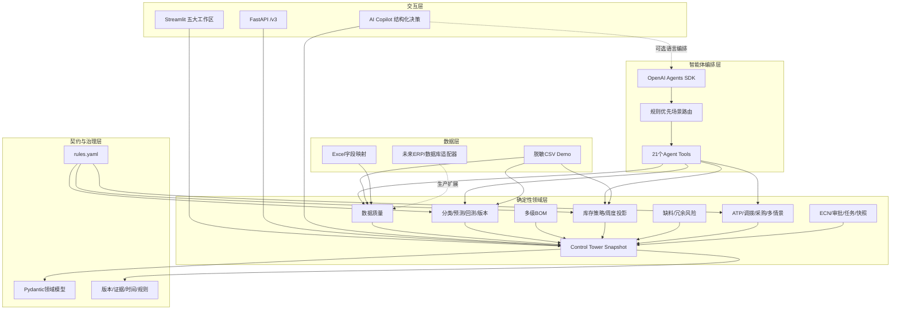
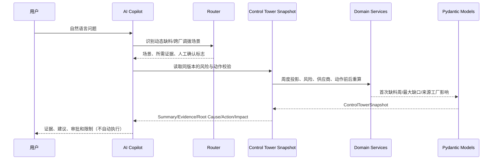
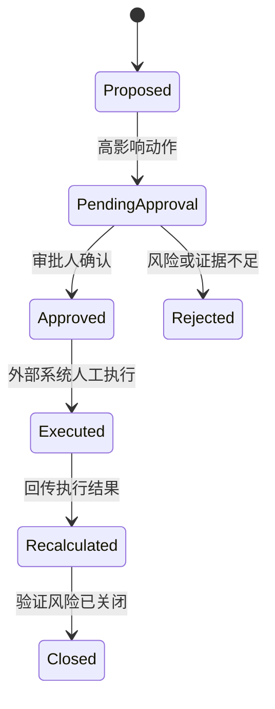

# SupplyPilot Control Tower与智能体技术架构

## 1. 架构目标

SupplyPilot定位为“Supply Chain Control Tower + AI Copilot”。控制塔负责把需求、库存、采购、供应商和任务汇总为一致的决策视图；Copilot负责把已验证结果组织为结论、证据、根因和动作。它不是让大模型代替MRP计算，而是让确定性领域服务负责数量、金额、风险等级和动作影响。

核心目标：

- 将自然语言问题映射到明确的供应链场景；
- 把预测、BOM、库存、风险和优化能力封装为可验证工具；
- 所有重要结论可回溯到数据版本、规则和证据；
- 任何高影响动作在建议前都重新计算库存影响；
- 在Demo与未来ERP适配器之间保留清晰边界。

## 2. 五大工作区

| 工作区 | 主要职责 | 代表性输出 |
|---|---|---|
| Overview | 跨模块态势感知和优先级排序 | KPI、Actual/Forecast、风险热力图、风险队列、行动中心 |
| Demand Forecast | 需求治理、分类、预测与版本 | WAPE、Bias、滚动回测、情景带、人工调整/FVA |
| Inventory | BOM到物料、周度供需与库存策略 | 首次缺料周、最大缺口、冗余、覆盖周数、安全库存 |
| Procurement | PO、供应商与跨工厂协同 | PO提前/取消、ATP、调拨、供应商可靠性、审批任务 |
| AI Copilot | 证据驱动的自然语言决策说明 | Summary、Risk、Evidence、Root Cause、Recommendation、Expected Impact |

导航只重组展示层。原有页面、确定性服务、兼容工具和`?page=`直达链接继续保留。

## 3. 分层架构

控制塔通过[`src/services/control_tower.py`](../src/services/control_tower.py)调用既有领域服务，生成可验证的`ControlTowerSnapshot`；Streamlit组件和`/v3/control-tower`读取同一契约，不在页面中重复计算业务口径。

## 4. LLM和Python的职责边界

| 能力 | LLM | 确定性Python |
|---|---:|---:|
| 理解自然语言问题 | ✓ | — |
| 场景路由辅助 | ✓ | 规则路由为主 |
| 需求分类 | — | ✓ |
| 预测数量与回测指标 | — | ✓ |
| BOM用量 | — | ✓ |
| 库存、缺口、冗余、金额 | — | ✓ |
| 调拨与采购候选求解 | — | ✓ |
| 解释风险原因 | ✓ | 提供结构化证据 |
| 组织处置建议与报告 | ✓ | 提供动作约束和计算结果 |
| 控制塔KPI和风险热力分级 | — | ✓ |
| 动作前后影响 | — | ✓ |
| 自动执行高影响动作 | 禁止 | 禁止 |

LLM不能补齐缺失的关键业务数据，也不能根据语言直觉计算库存或声称收益。Copilot只返回业务可见的结构化依据，不输出内部推理链；没有OpenAI API Key时，Demo仍可用确定性问答路由展示完整证据链。

## 5. 一次问题的调用链

示例问题：“MAT-B下个月是否缺料，能否从其他工厂调拨？”

MAT-B Hero Demo中，基准最大缺口为8,800件；调拨1,800件后最大缺口为7,000件，首次缺料从2026-08-24推迟至2026-09-21，来源工厂没有新增缺料且不低于安全库存。数值来自`action_validation.py`重算，不由Copilot生成。

## 6. 场景路由

[`src/router.py`](../src/router.py)覆盖数据质量、需求变化、Forecast版本、人工调整、供应延期、静态/动态缺料、低安全库存、冗余、呆滞、无需求有PO、EOL、PO调整、调拨、替代、ECN和What-if。

路由输出固定包含：

- `scenario_type`；
- `confidence`；
- `trigger_rules`；
- `required_tools`；
- `missing_data`；
- `requires_human_confirmation`。

规则可以被测试和审计；LLM只在自然语言表达含糊时补充理解。

## 7. 工具设计

工具分为四类：

| 类型 | 示例 | 是否改变源数据 |
|---|---|---:|
| 查询 | 冗余组合、ECN候选、采购单据 | 否 |
| 计算 | 预测、BOM、库存投影、安全库存 | 否 |
| 优化/模拟 | ATP、调拨、PO消冗、多情景优化 | 否 |
| 审批建议 | PO取消、替代、ECN、报废 | 否，仅输出审批对象 |

兼容工具仍保留原调用方式；新增V2/V3工具将输入转换为Pydantic模型并返回可验证JSON。

## 8. 领域服务

| 服务 | 作用 |
|---|---|
| `data_quality.py` | 数据质量门禁与结构化问题报告 |
| `demand_classification.py` | ABC/XYZ/ADI-CV²/生命周期 |
| `forecasting.py` | 11类基础预测模型、EOL DECAY衰减策略和区间输出 |
| `backtesting.py` | 无未来数据泄漏的滚动回测 |
| `forecast_versioning.py` | 统计、调整、共识版本和FVA |
| `bom.py` | 多层BOM、版本、损耗、换算和循环检测 |
| `inventory_policy.py` | 安全库存、ROP、库存位置和补货量 |
| `inventory_projection.py` | 周度供需时序和缺口/冗余 |
| `risks.py` | 缺料、低安全库存和冗余证据 |
| `action_validation.py` | 动作前后重算及新缺料拦截 |
| `allocation.py` | 共用料ATP和客户优先级 |
| `transfer_optimization.py` | 来源保护下的最小成本调拨 |
| `procurement_optimization.py` | PO取消/延期及批量价格优化 |
| `scenario_optimization.py` | 多需求/供给情景的鲁棒成本选择 |
| `ecn_workflow.py` | ECN证据与角色门禁 |
| `task_management.py` | 风险任务、提醒和升级 |
| `supplier_reliability.py` | 准时、齐套、确认和交期稳定性 |
| `control_tower.py` | 聚合KPI、趋势、风险热力、洞察、动作校验和结构化Copilot证据 |

展示层位于`src/ui/`：`navigation.py`负责五大工作区和旧路由兼容，`charts.py`负责预测/库存可视化，`components.py`负责KPI、风险徽章、行动卡片和结构化响应，`control_tower.py`、`workspaces.py`与`copilot.py`负责页面组合。

## 9. 数据和规则

### 数据

- 原V2 CSV保留，用于兼容查询和数据质量演示，其中18组重复采购单号仍作为阻断问题展示；
- `demo_*.csv`是闭环能力的合成数据；
- 控制塔只读取隔离的`DEMO-*`演示版本，并在快照中明确返回来源版本；这不代表旧V2阻断项已被修复，也不会静默填补关键字段；
- Excel导入使用显式字段映射与类型校验；
- 数据访问集中在[`src/repository.py`](../src/repository.py)和Demo适配层。

### 规则

[`config/rules.yaml`](../config/rules.yaml)集中管理：

- 预测周期、回测窗口和模型参数；
- ABC/XYZ/ADI-CV²阈值；
- 服务水平与安全库存默认值；
- 缺料/冗余分级；
- MOQ、MPQ、包装、PO窗口和成本；
- ATP、调拨和多情景优化权重；
- ECN证据门禁、审批矩阵和任务升级。

[`src/config.py`](../src/config.py)在启动时进行类型、范围和结构校验。

## 10. Human-in-the-loop

当前仓库只实现到建议、审批信息和模拟验证，不向ERP写入`Executed`状态。前端的“审批/修改/拒绝”只改变Demo会话状态，不等于外部系统已执行。

## 11. 测试策略

140项测试重点覆盖领域计算、控制塔/API契约与导航，而非只测试页面：

- 全零需求、短历史、稳定/趋势/季节/间歇需求；
- WAPE除零、Bias方向和滚动回测数据泄漏；
- 单层/多层/共用/版本BOM与循环BOM；
- 冻结、质检、已分配、安全库存和晚到PO；
- 总量不缺但中间周缺料；
- 取消PO制造缺料、调拨损害来源工厂、替代料不足；
- MOQ/MPQ/价格阶梯、取消窗口和锁定量；
- ECN、Forecast调整、任务状态的非法跳转；
- 多情景下不安全方案拒绝。
- 控制塔KPI与领域结果对账、Actual/Forecast边界和情景带上下界；
- 风险热力图分级、MAT-B调拨与MAT-A取消PO的动作前后重算；
- 结构化Copilot证据、业务规则、限制和无内部推理链输出；
- 五大工作区映射、旧智能问答别名和原页面直达兼容。

相同输入必须产生相同结果；Demo不使用随机求解器。

## 12. 生产化扩展点

当前是完整可运行的决策支持Demo，生产化仍需：

1. 数据库持久化预测版本、任务、审批和快照；
2. ERP/MES/WMS/SRM只读适配器与写回审批网关；
3. SSO、角色权限、字段级脱敏和审计日志；
4. 供应商日历、币种、税费、产能和复杂价格协议；
5. 作业调度、监控、告警和重试；
6. 使用企业历史数据校准阈值、损失成本和服务水平。
