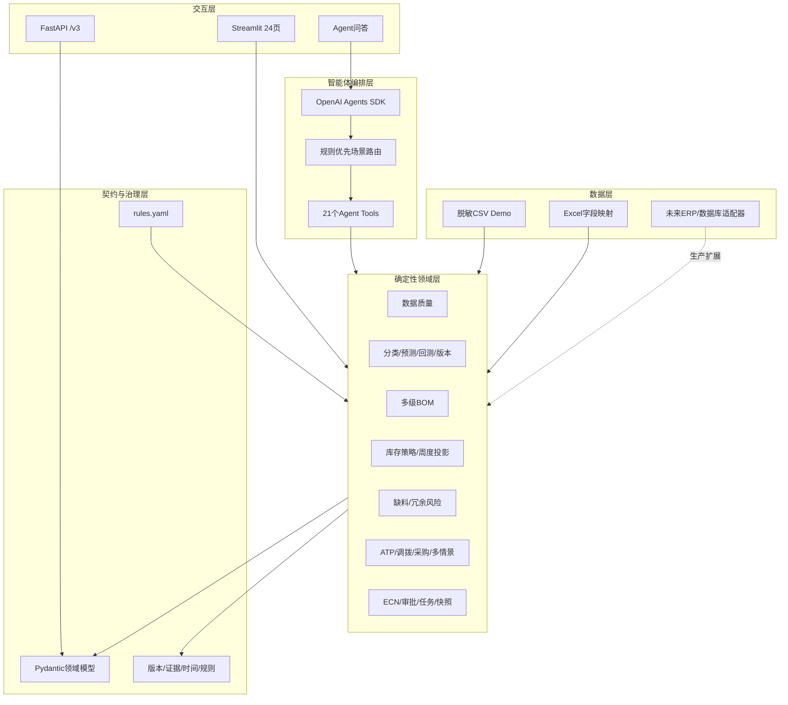
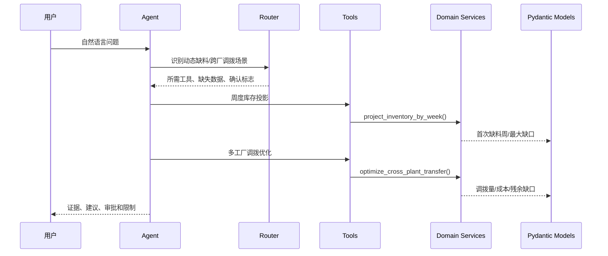
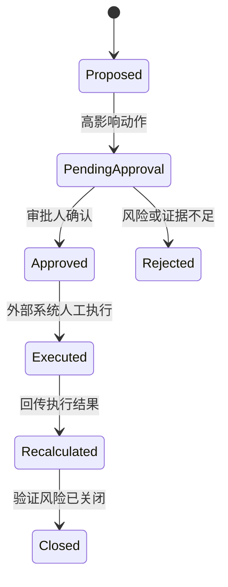

# SupplyPilot智能体与技术架构

## 1. 架构目标

SupplyPilot不是让大模型代替MRP计算，而是让智能体负责理解问题、选择工具和组织解释，让确定性领域服务负责数量、金额和状态计算。

核心目标：

- 将自然语言问题映射到明确的供应链场景；
- 把预测、BOM、库存、风险和优化能力封装为可验证工具；
- 所有重要结论可回溯到数据版本、规则和证据；
- 任何高影响动作在建议前都重新计算库存影响；
- 在Demo与未来ERP适配器之间保留清晰边界。

## 2. 分层架构

## 3. LLM和Python的职责边界

| 能力 | LLM | 确定性Python |
|---|---:|---:|
| 理解自然语言问题 | ✓ | — |
| 场景路由辅助 | ✓ | 规则路由为主 |
| 需求分类 | — | ✓ |
| 预测数量与回测指标 | — | ✓ |
| BOM用量 | — | ✓ |
| 库存、缺口、冗余、金额 | — | ✓ |
| 调拨与采购候选求解 | — | ✓ |
| 解释风险原因 | ✓ | 提供结构化证据 |
| 组织处置建议与报告 | ✓ | 提供动作约束和计算结果 |
| 自动执行高影响动作 | 禁止 | 禁止 |

LLM不能补齐缺失的关键业务数据，也不能根据语言直觉计算库存或声称收益。

## 4. 一次问题的调用链

示例问题：“MAT-B下个月是否缺料，能否从其他工厂调拨？”

## 5. 场景路由

[`src/router.py`](../src/router.py)覆盖数据质量、需求变化、Forecast版本、人工调整、供应延期、静态/动态缺料、低安全库存、冗余、呆滞、无需求有PO、EOL、PO调整、调拨、替代、ECN和What-if。

路由输出固定包含：

- `scenario_type`；
- `confidence`；
- `trigger_rules`；
- `required_tools`；
- `missing_data`；
- `requires_human_confirmation`。

规则可以被测试和审计；LLM只在自然语言表达含糊时补充理解。

## 6. 工具设计

工具分为四类：

| 类型 | 示例 | 是否改变源数据 |
|---|---|---:|
| 查询 | 冗余组合、ECN候选、采购单据 | 否 |
| 计算 | 预测、BOM、库存投影、安全库存 | 否 |
| 优化/模拟 | ATP、调拨、PO消冗、多情景优化 | 否 |
| 审批建议 | PO取消、替代、ECN、报废 | 否，仅输出审批对象 |

兼容工具仍保留原调用方式；新增V2/V3工具将输入转换为Pydantic模型并返回可验证JSON。

## 7. 领域服务

| 服务 | 作用 |
|---|---|
| `data_quality.py` | 数据质量门禁与结构化问题报告 |
| `demand_classification.py` | ABC/XYZ/ADI-CV²/生命周期 |
| `forecasting.py` | 11类预测模型和区间输出 |
| `backtesting.py` | 无未来数据泄漏的滚动回测 |
| `forecast_versioning.py` | 统计、调整、共识版本和FVA |
| `bom.py` | 多层BOM、版本、损耗、换算和循环检测 |
| `inventory_policy.py` | 安全库存、ROP、库存位置和补货量 |
| `inventory_projection.py` | 周度供需时序和缺口/冗余 |
| `risks.py` | 缺料、低安全库存和冗余证据 |
| `action_validation.py` | 动作前后重算及新缺料拦截 |
| `allocation.py` | 共用料ATP和客户优先级 |
| `transfer_optimization.py` | 来源保护下的最小成本调拨 |
| `procurement_optimization.py` | PO取消/延期及批量价格优化 |
| `scenario_optimization.py` | 多需求/供给情景的鲁棒成本选择 |
| `ecn_workflow.py` | ECN证据与角色门禁 |
| `task_management.py` | 风险任务、提醒和升级 |
| `supplier_reliability.py` | 准时、齐套、确认和交期稳定性 |

## 8. 数据和规则

### 数据

- 原V2 CSV保留，用于兼容查询和数据质量演示；
- `demo_*.csv`是闭环能力的合成数据；
- Excel导入使用显式字段映射与类型校验；
- 数据访问集中在[`src/repository.py`](../src/repository.py)和Demo适配层。

### 规则

[`config/rules.yaml`](../config/rules.yaml)集中管理：

- 预测周期、回测窗口和模型参数；
- ABC/XYZ/ADI-CV²阈值；
- 服务水平与安全库存默认值；
- 缺料/冗余分级；
- MOQ、MPQ、包装、PO窗口和成本；
- ATP、调拨和多情景优化权重；
- ECN证据门禁、审批矩阵和任务升级。

[`src/config.py`](../src/config.py)在启动时进行类型、范围和结构校验。

## 9. Human-in-the-loop

当前仓库只实现到建议、审批信息和模拟验证，不向ERP写入`Executed`状态。

## 10. 测试策略

124项测试重点覆盖领域计算而非只测试页面：

- 全零需求、短历史、稳定/趋势/季节/间歇需求；
- WAPE除零、Bias方向和滚动回测数据泄漏；
- 单层/多层/共用/版本BOM与循环BOM；
- 冻结、质检、已分配、安全库存和晚到PO；
- 总量不缺但中间周缺料；
- 取消PO制造缺料、调拨损害来源工厂、替代料不足；
- MOQ/MPQ/价格阶梯、取消窗口和锁定量；
- ECN、Forecast调整、任务状态的非法跳转；
- 多情景下不安全方案拒绝。

相同输入必须产生相同结果；Demo不使用随机求解器。

## 11. 生产化扩展点

当前是完整可运行的决策支持Demo，生产化仍需：

1. 数据库持久化预测版本、任务、审批和快照；
2. ERP/MES/WMS/SRM只读适配器与写回审批网关；
3. SSO、角色权限、字段级脱敏和审计日志；
4. 供应商日历、币种、税费、产能和复杂价格协议；
5. 作业调度、监控、告警和重试；
6. 使用企业历史数据校准阈值、损失成本和服务水平。
