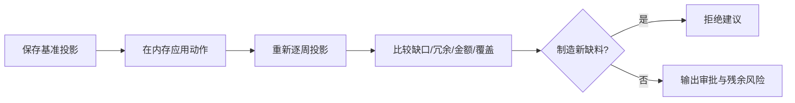

# SupplyPilot公式与规则手册

本文档回答四个问题：系统为什么得出这个结论、使用了哪些数据、如何处理边界条件、在哪里可以核对代码和测试。

> 所有阈值、权重、服务水平和默认成本均从[`config/rules.yaml`](../config/rules.yaml)加载。本文中的示例只适用于合成Demo，不代表生产参数。

## 1. 需求分类

实现位置：[`demand_classification.py`](../src/services/demand_classification.py)  
测试位置：[`test_demand_classification.py`](../tests/test_demand_classification.py)

### 1.1 ABC年度使用价值

$$
AnnualValue_i = AnnualDemand_i \times UnitCost_i
$$

按年度使用价值从高到低排序，再依据累计价值贡献划分A/B/C。A类代表少数高价值对象，不等于高波动物料。

| 变量 | 含义 | 单位 |
|---|---|---|
| $AnnualDemand_i$ | 最近最多52期的需求合计 | 件/年 |
| $UnitCost_i$ | 单位成本 | 元/件 |
| $AnnualValue_i$ | 年度使用价值 | 元/年 |

边界：全部物料年度价值为0时归为C类，避免伪造价值排序。

### 1.2 XYZ波动分类

$$
CV_i = \frac{\sigma_i}{\overline{D}_i}
$$

X类通常为稳定需求；Y类包含中等波动、趋势或季节信号；Z类为高波动。系统还检查前后半段趋势率和季节滞后相关性，不只依赖CV。

边界：平均需求为0时CV返回空值并归入Z类复核，不发生除零。

### 1.3 ADI与CV²间歇需求分类

$$
ADI_i = \frac{TotalPeriods_i}{NonZeroPeriods_i}
$$

$$
CV_i^2 = \left(\frac{\sigma_{nonzero,i}}{\overline{D}_{nonzero,i}}\right)^2
$$

| ADI | CV² | 分类 |
|---|---|---|
| 低 | 低 | Smooth |
| 低 | 高 | Erratic |
| 高 | 低 | Intermittent |
| 高 | 高 | Lumpy |

间歇/Lumpy需求的候选模型限定为Croston、SBA、TSB，避免用普通移动平均把大量零需求平滑成持续需求。

## 2. 预测评估与模型选择

实现位置：[`forecast_metrics.py`](../src/services/forecast_metrics.py)、[`backtesting.py`](../src/services/backtesting.py)、[`forecasting.py`](../src/services/forecasting.py)  
测试位置：[`test_forecasting.py`](../tests/test_forecasting.py)

### 2.1 WAPE

$$
WAPE = \frac{\sum_t |A_t-F_t|}{\sum_t A_t}
$$

WAPE衡量相对总需求的绝对误差。若实际需求合计为0，返回`null`而不是除零或声称模型准确。

### 2.2 Bias

$$
Bias = \frac{\sum_t(F_t-A_t)}{\sum_t A_t}
$$

- 正Bias：整体高估需求；
- 负Bias：整体低估需求；
- 实际需求合计为0：返回`null`。

### 2.3 MAE

$$
MAE = \frac{1}{n}\sum_t|A_t-F_t|
$$

### 2.4 库存导向模型得分

$$
ModelScore = w_1 WAPE + w_2|Bias| + w_3StockoutLoss + w_4ExcessLoss
$$

其中：

$$
StockoutLoss = \frac{\sum_t\max(0,A_t-F_t)\times C_s}{\max(\sum_t A_t,1)}
$$

$$
ExcessLoss = \frac{\sum_t\max(0,F_t-A_t)\times C_e}{\max(\sum_t A_t,1)}
$$

模型选择同时考虑误差、系统性偏差、缺货代价和冗余代价，而不是只追求一个统计指标最低。滚动回测的每一折只使用预测起点之前的数据，避免未来数据泄漏。

### 2.5 FVA

$$
FVA = ErrorBeforeAdjustment - ErrorAfterAdjustment
$$

- $FVA>0$：人工调整改善预测；
- $FVA<0$：人工调整使预测恶化；
- 尚无实际需求：状态为`PENDING_ACTUALS`，不得提前评价。

实现位置：[`forecast_versioning.py`](../src/services/forecast_versioning.py)

### 2.6 Forecast情景带（非统计置信区间）

实现位置：[`forecasting.py`](../src/services/forecasting.py)
控制塔测试：[`test_control_tower.py`](../tests/test_control_tower.py)

系统先根据历史需求波动率与配置倍率形成情景带宽：

$$
Band=\min\left(1,\max\left(Band_{min},Volatility\times Multiplier\right)\right)
$$

再围绕基准预测形成上下限：

$$
Lower_t=\max(0,Forecast_t\times(1-Band))
$$

$$
Upper_t=Forecast_t\times(1+Band)
$$

这组上下限用于乐观/悲观情景展示和人工复核，不是从预测误差分布估计出的统计置信区间，也不代表80%、90%或95%的概率覆盖。`ForecastConfidence`同样是根据数据长度、波动、间歇性和回测表现形成的规则等级，不应解释为概率。

## 3. 多级BOM需求拆解

实现位置：[`bom.py`](../src/services/bom.py)  
测试位置：[`test_bom.py`](../tests/test_bom.py)

单层边的基础用量：

$$
Usage_{p,c}=UnitUsage_{p,c}\times ConversionFactor_{p,c}
$$

包含损耗后的用量：

$$
GrossUsage_{p,c}=Usage_{p,c}\times(1+LossRate_{p,c})
$$

任意层级路径的累计用量：

$$
CumulativeUsage_{i,m}=\prod_{e\in Path(i,m)}GrossUsage_e
$$

最终物料毛需求：

$$
GrossRequirement_{m,t}=\sum_i Forecast_{i,t}\times CumulativeUsage_{i,m}
$$

系统按需求周选择生效BOM版本，并保留成品、路径、BOM版本、基础数量、损耗数量和毛需求。无有效BOM、单位用量非正、换算系数非正或循环引用均阻断计算。

## 4. 可用库存与周度投影

实现位置：[`inventory_projection.py`](../src/services/inventory_projection.py)  
测试位置：[`test_inventory.py`](../tests/test_inventory.py)

### 4.1 初始可用库存

$$
AvailableInventory = OnHand-Frozen-QualityHold-Allocated+ReusableReturn
$$

冻结、质检和已分配库存不能直接用于满足新需求；可复用退货经业务确认后加入可用量。

### 4.2 周度库存状态

$$
Incoming_t=POReceipt_t+ProductionReceipt_t+TransferIn_t
$$

$$
Outgoing_t=GrossDemand_t+ReservedDemand_t+TransferOut_t
$$

$$
EndingInventory_t=BeginningInventory_t+Incoming_t-Outgoing_t
$$

下周期期初等于本周期期末。该时间递推是识别“总量不缺、中间周缺料”的基础。

### 4.3 缺料、低于安全库存和净需求

$$
Shortage_t=\max(0,-EndingInventory_t)
$$

$$
BelowSafety_t=\max(0,SafetyStock_t-EndingInventory_t)
$$

$$
NetRequirement_t=\max(0,Outgoing_t+SafetyStock_t-BeginningInventory_t-Incoming_t)
$$

### 4.4 ATP与决策冗余

$$
ATP_t=\max(0,EndingInventory_t-SafetyStock_t)
$$

$$
Excess_t=\max(0,EndingInventory_t-SafetyStock_t)
$$

$$
ExcessValue_t=Excess_t\times UnitCost
$$

当前Demo在单周期结果中，ATP与期末决策冗余使用相同数量口径，但业务用途不同：ATP用于承诺，冗余用于识别可处置供给。真实系统还应叠加冻结区、客户承诺、处置周期和不可取消供给。

### 4.5 覆盖周数

$$
CoverageWeeks_t=\frac{\max(0,EndingInventory_t)}{MeanPositiveFutureDemand_t}
$$

若未来没有正需求，覆盖周数返回空值，避免把“无限覆盖”作为正常库存指标。

### 4.6 控制塔库存风险热力分级

实现位置：[`control_tower.py`](../src/services/control_tower.py)

每个“物料×周”单元格使用确定性优先级规则：

| 优先级 | 条件 | 状态 |
|---:|---|---|
| 1 | $EndingInventory_t<0$ | Critical，已发生动态缺料 |
| 2 | $0\le EndingInventory_t<SafetyStock_t$ | Risk，低于安全库存 |
| 3 | $SafetyStock_t\le EndingInventory_t<buffer\_multiplier\times SafetyStock_t$ | Watch，缓冲偏低 |
| 4 | 预测连续下调且$ExcessValue_t\ge critical\_value$ | Critical，严重冗余敞口 |
| 5 | 预测连续下调且$ExcessValue_t\ge high\_value$ | Risk，高冗余敞口 |
| 6 | 预测连续下调且$ExcessValue_t\ge medium\_value$ | Watch，中等冗余敞口 |
| 7 | 以上均未触发 | Healthy |

`buffer_multiplier`来自`control_tower.inventory_watch_buffer_multiplier`（Demo为1.5）；三档金额阈值分别来自`risk.excess.critical_value/high_value/medium_value`。规则按表中顺序命中，热力图颜色只是状态的视觉映射，不是缺料概率。鼠标详情同时显示期末库存、安全库存、需求、到货、缺口、冗余和数据版本。

## 5. 安全库存与补货

实现位置：[`inventory_policy.py`](../src/services/inventory_policy.py)  
测试位置：[`test_inventory.py`](../tests/test_inventory.py)

### 5.1 安全库存

$$
SS=z\times\sqrt{\overline{LT}\sigma_D^2+\overline{D}^{2}\sigma_{LT}^2}
$$

| 变量 | 含义 |
|---|---|
| $z$ | 服务水平对应的正态分布分位数 |
| $\overline{LT}$ | 平均交期，周 |
| $\sigma_D^2$ | 周需求方差 |
| $\overline{D}$ | 平均周需求 |
| $\sigma_{LT}^2$ | 交期方差 |

缺少交期方差或服务水平时，系统使用`rules.yaml`中的显式默认值并返回警告。

### 5.2 再订货点与库存位置

$$
ROP=\overline{D}\times\overline{LT}+SS
$$

$$
InventoryPosition=OnHand+OnOrder-Allocated
$$

$$
RawOrder=\max(0,TargetInventory-InventoryPosition)
$$

建议订货量再按MOQ、MPQ和包装倍数取整。EOL物料默认限制新增补货，必须人工确认售后需求。

## 6. 共用料ATP分配

实现位置：[`allocation.py`](../src/services/allocation.py)  
测试位置：[`test_phase2_allocation_transfer.py`](../tests/test_phase2_allocation_transfer.py)

$$
AllocatableSupply=\max(0,AvailableSupply-ProtectedSupply)
$$

排序分数：

$$
Score_i=FrozenBonus_i+CustomerPriority_i\times w_c
+ShortagePenalty_i\times w_s+\frac{w_u}{1+UrgencyWeeks_i}+LifecycleWeight_i
$$

若启用最低公平份额，先按需求比例分配下限，再按分数从高到低分配剩余供给。所有分配量之和不会超过可分配供给。

## 7. 多工厂调拨

实现位置：[`transfer_optimization.py`](../src/services/transfer_optimization.py)  
测试位置：[`test_phase2_allocation_transfer.py`](../tests/test_phase2_allocation_transfer.py)

### 7.1 来源可调拨量

$$
SourceAvailable_p=\max(0,OnHand_p-Protected_p-FutureDemand_p-MinimumCoverage_p)
$$

### 7.2 通道可行性

通道必须同时满足：

1. 物料、版本与质量兼容；
2. 运输交期不超过配置上限；
3. `AsOfDate + LeadTimeDays ≤ NeedDate`；
4. 来源可调拨量和目标缺口均大于0。

求解器使用确定性最小成本流。用于寻路的有效单位成本为：

$$
EffectiveCost_{p,q}=UnitCost_{p,q}+\frac{FixedCost_{p,q}}{Capacity_{p,q}}
-Priority_q\times ShortagePenalty
$$

结果成本仍按实际调拨量计算：

$$
TransferCost=Quantity\times UnitCost+FixedCost
$$

## 8. PO取消与延期优化

实现位置：[`procurement_optimization.py`](../src/services/procurement_optimization.py)  
测试位置：[`test_phase2_procurement.py`](../tests/test_phase2_procurement.py)

取消罚金：

$$
Penalty=CancelQty\times UnitPrice\times CancellationPenaltyRate
$$

取消避免成本：

$$
AvoidedCancelCost=CancelQty\times(HoldingCost\times ProtectionWeeks+ObsolescenceCost)
$$

方案净收益：

$$
NetBenefit=AvoidedHolding+AvoidedObsolescence-Penalty
$$

硬约束：

- 取消与延期总量不超过已确认的决策冗余；
- 锁定数量不可取消；
- 超过取消期限的PO不进入候选；
- 取消数量遵循MPQ；
- 优化只输出建议，不写回PO。

## 9. MOQ、MPQ、包装和价格阶梯

实现位置：[`procurement_optimization.py`](../src/services/procurement_optimization.py)

候选数量满足：

$$
Q=0\quad or\quad Q\ge MOQ
$$

$$
Q=k\times LCM(MPQ,PackageMultiple)
$$

每个候选量根据适用价格阶梯计算：

$$
TotalCost(Q)=Q\times UnitPrice(Q)+Surplus(Q)\times HoldingCost
+Shortage(Q)\times ShortageCost+FixedOrderCost
$$

在全部确定性可行候选中选择总成本最低者；如果缺货成本设置过低，模型可能理性地选择少订，因此生产参数必须经过业务校准。

## 10. 多情景库存成本

实现位置：[`scenario_optimization.py`](../src/services/scenario_optimization.py)  
测试位置：[`test_phase2_supplier_scenario_dashboard.py`](../tests/test_phase2_supplier_scenario_dashboard.py)

单一情景成本：

$$
Cost_{d,s}=HoldingCost_{d,s}+ShortageCost_{d,s}+EndingExcessCost_{d,s}+ActionCost_d
$$

期望成本：

$$
ExpectedCost_d=\sum_s Probability_s\times Cost_{d,s}
$$

鲁棒可行门禁：

$$
MaximumShortage_{d,s}\le AllowedShortage,\quad \forall s
$$

只有在每个配置情景下都满足缺料上限的决策才进入最终选择；若不存在安全方案，返回`INFEASIBLE`，不会推荐“期望成本低但会制造缺料”的动作。

## 11. 供应商可靠性

实现位置：[`supplier_reliability.py`](../src/services/supplier_reliability.py)

$$
OnTimeRate=\frac{OnTimeDeliveries}{TotalDeliveries}
$$

$$
FillRate=\min\left(1,\frac{ReceivedQty}{OrderedQty}\right)
$$

$$
LeadTimeStability=\frac{1}{1+\frac{\sigma_{LT}}{\max(\overline{LT},1)}}
$$

$$
ReliabilityScore=w_1OnTimeRate+w_2FillRate+w_3LeadTimeStability+w_4ConfirmationAdherence
$$

样本数低于配置下限或部分订单缺确认日期时，结果附带置信度警告。

## 12. 动作校验原则

实现位置：[`action_validation.py`](../src/services/action_validation.py)  
测试位置：[`test_actions_router_versioning.py`](../tests/test_actions_router_versioning.py)

每个动作都遵循同一过程：

高影响动作包括PO取消、跨厂调拨、替代料、ECN切换和报废。系统不直接执行这些动作。

动作卡片使用同一组前后结果计算改善量：

$$
ShortageReduction=MaximumShortage_{before}-MaximumShortage_{after}
$$

$$
ExcessReduction=EndingExcess_{before}-EndingExcess_{after}
$$

只有动作后没有制造新缺料、且相关工厂/产品校验通过时，系统才可返回“建议执行”；这仍不等于已经审批或已经写回ERP。

控制塔已核验Demo：

- MAT-B跨厂调拨1,800件：最大缺口$8{,}800\rightarrow7{,}000$，首次缺料由`2026-08-24`推迟至`2026-09-21`，来源工厂最大缺口为0且期末库存不低于安全库存；
- MAT-A取消8,000件未锁定PO：期末冗余$9{,}000\rightarrow1{,}000$，动作后最大缺口为0。

## 13. 追溯字段

核心输出至少包含以下追溯信息中的适用部分：

- `data_version` / `source_version`；
- `rules_version`；
- `forecast_version_id`；
- `calculated_at`；
- `evidence`和触发规则；
- 模型、BOM路径、单据、工厂、客户和审批对象。

这样可以从页面结论回到输入版本、配置规则、Python函数和自动化测试。
