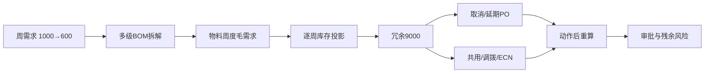

# 案例1：需求下降导致库存冗余

## 业务问题

产品A未来周需求从1,000下降到600。计划员需要判断需求变化会形成多少物料冗余、哪些PO可以取消或延期，以及旧料是否可以通过共用或ECN继续消耗。

## 输入

- 产品：`PRODUCT_A`；
- 物料：`MAT-A`；
- 工厂：`DEMO_PLANT`；
- 需求变化率：-40%；
- 单位成本：18；
- 在途PO：16,000；
- 预测版本：`CONSENSUS-DEMO-600`；
- 模拟动作：取消8,000在途PO、评估2,000旧料ECN消耗。

数据来源：[`demo_weekly_inventory.csv`](../../data/demo_weekly_inventory.csv)、[`demo_bom_extended.csv`](../../data/demo_bom_extended.csv)。

## 计算链路



周度投影：

$$
Ending_t=Beginning_t+Receipts_t+TransferIn_t-Demand_t-Reserved_t-TransferOut_t
$$

决策冗余：

$$
Excess_t=\max(0,Ending_t-SafetyStock_t)
$$

动作安全门禁：取消PO后必须重新计算全部周次，若制造新缺料则拒绝建议。

## Demo结果

| 指标 | 动作前 | 取消8,000 PO后 |
|---|---:|---:|
| 期末决策冗余 | 9,000 | 1,000 |
| 新增缺料 | — | 否 |
| 建议执行 | — | 是 |
| 审批 | — | 采购经理、计划经理 |

第二阶段成本优化进一步在单据层比较取消罚金、持有成本和过时成本：对9,000冗余给出取消6,000、延期3,000的组合方案，Demo罚金5,040、净避免成本5,760。

## 为什么不能直接“砍库存”

库存是需求、交期、批量、计划稳定性和组织行为的结果。消冗顺序应为：

1. 冻结新增采购；
2. 删除未转PO的PR、取消未锁定PO；
3. 延期或拆分PO；
4. 跨产品共用、跨工厂调拨；
5. 完成验证后使用替代料或ECN；
6. 退换、计提或报废。

每一步都必须检查是否损害未来服务水平。

## 运行

```powershell
python examples/run_cases.py --case 1
python examples/run_phase2_cases.py --case 3
```

对应代码：[`inventory_projection.py`](../../src/services/inventory_projection.py)、[`risks.py`](../../src/services/risks.py)、[`action_validation.py`](../../src/services/action_validation.py)、[`procurement_optimization.py`](../../src/services/procurement_optimization.py)。

[返回案例库](README.md)
