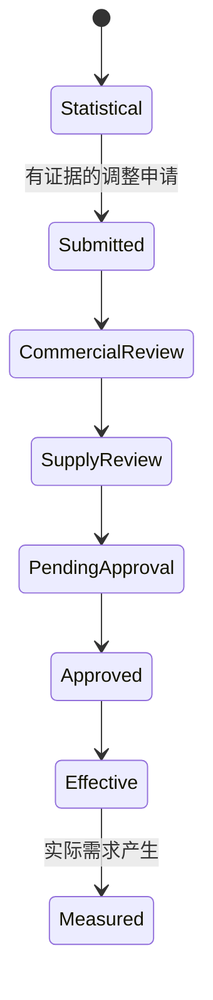

# 案例5：人工预测调整与FVA

## 业务问题

统计模型无法预见新项目、促销、客户停产或设计变更。人工判断可以调整预测，但必须有证据、版本和实际后的效果评价。

## 工作流



没有实际值时，FVA状态必须保持`PENDING_ACTUALS`。

## FVA公式

$$
FVA=ErrorBeforeAdjustment-ErrorAfterAdjustment
$$

- 正数：人工调整改善预测；
- 负数：人工调整使预测恶化；
- 无实际需求：不评价。

## Demo

客户确认新增项目需求，计划员将首周预测增加100，并形成：

1. 统计预测版本；
2. 人工调整版本；
3. 已审批共识版本；
4. BOM与库存计划默认使用共识版本。

实际需求产生后：

| 指标 | 结果 |
|---|---:|
| 调整前误差 | 0.090806 |
| 调整后误差 | 0 |
| FVA | 0.090806 |
| 状态 | IMPROVED |

这是合成案例的单次结果，不代表人工判断通常优于统计模型。

## 运行

```powershell
python examples/run_cases.py --case 5
python examples/run_phase2_cases.py --case 7
```

对应代码：[`forecast_versioning.py`](../../src/services/forecast_versioning.py)、[`forecast_adjustment_workflow.py`](../../src/services/forecast_adjustment_workflow.py)。

[返回案例库](README.md)
