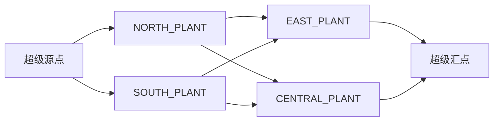

# 案例7：多工厂调拨优化

## 业务问题

目标工厂存在缺料，其他工厂有库存。调拨不能只看来源在手量，还需保护来源工厂未来需求、安全覆盖，并检查运输通道是否兼容和来得及。

## 来源可调拨量

$$
SourceAvailable_p=\max(0,OnHand_p-Protected_p-FutureDemand_p-MinimumCoverage_p)
$$

## 通道门禁

通道需要同时满足：

- 物料、版本和质量兼容；
- 运输交期不超过配置上限；
- 预计到货日不晚于目标需求日；
- 来源有可调拨量且目标有缺口。

## 求解逻辑

系统建立“超级源点—来源工厂—目标工厂—超级汇点”网络，使用确定性最小成本流寻找方案。目标优先级通过缺货罚金进入有效通道成本。



## Demo结果

| 指标 | 结果 |
|---|---:|
| 调拨前缺口 | 8,500 |
| 调拨后缺口 | 0 |
| NORTH → EAST | 5,000 |
| SOUTH → CENTRAL | 3,500 |
| 总调拨成本 | 9,860 |
| 求解状态 | OPTIMAL |

来源工厂的保护量、未来需求和最低覆盖已经在调拨前扣除。

## 运行

```powershell
python examples/run_phase2_cases.py --case 2
```

页面：`http://localhost:8501/?page=多工厂调拨优化`

对应代码：[`transfer_optimization.py`](../../src/services/transfer_optimization.py)。

[返回案例库](README.md)
