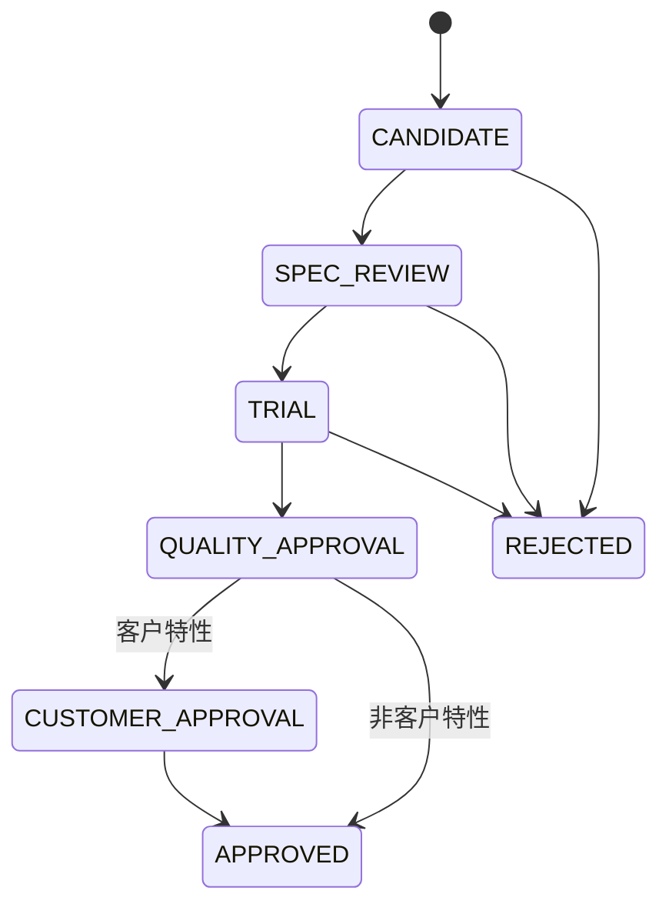

# 案例10：ECN验证状态机

## 业务问题

旧料存在冗余，新料已经导入。直接将旧料替换或切换可能产生规格、质量、客户批准和追溯风险，因此“ECN候选”不能等同于“批准替代”。

## 状态机



## 证据门禁

| 目标状态 | 必需证据 | 角色示例 |
|---|---|---|
| SPEC_REVIEW | 图纸比较、规格比较 | 研发/工程 |
| TRIAL | 试制计划 | 研发/制造 |
| QUALITY_APPROVAL | 试制结果、质量报告 | 质量 |
| CUSTOMER_APPROVAL | 客户提交/批准 | 客户/销售/项目 |
| APPROVED | 生效批次、追溯规则 | 计划/质量/供应链负责人 |

角色不匹配、证据缺失或跳过状态都会抛出验证错误。

## Demo结果

`MAT-A → MAT-A-NEW`依次完成规格、试制和质量验证，最终状态为`APPROVED`，并记录：

- 生效批次：`BATCH-2026-09`；
- 追溯规则：`OLD_STOCK_FIRST`；
- 每次迁移的操作人、角色、证据字段和时间。

## 运行

```powershell
python examples/run_phase2_cases.py --case 5
```

页面：`http://localhost:8501/?page=ECN验证状态机`

对应代码：[`ecn_workflow.py`](../../src/services/ecn_workflow.py)。

[返回案例库](README.md)
