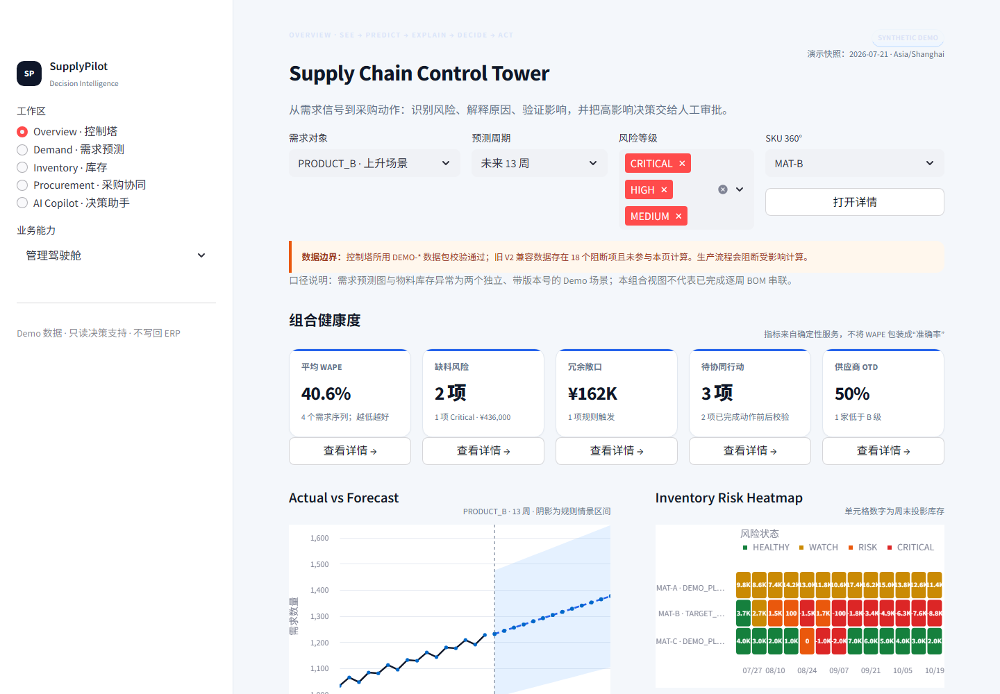
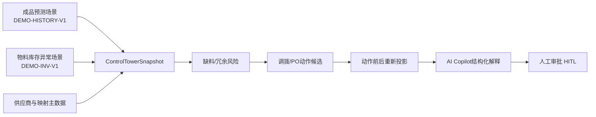

# 案例12：Supply Chain Control Tower Hero Demo

## 业务问题

计划工程师需要在一个页面内回答：未来需求是否上升、哪一周开始缺料、供应商是否晚到、能否跨厂调拨、动作是否损害来源工厂，以及哪些高影响动作需要审批。系统还应让AI Copilot用业务语言解释结论，但不能让大模型自行计算数量。

本案例把两个已核验场景放入同一个控制塔：

- `PRODUCT_B / MAT-B`：需求上升叠加供应商交期延误，形成动态缺料；
- `PRODUCT_A / MAT-A`：需求连续下调，但在途PO未同步收缩，形成库存冗余。

全部数据均为合成Demo。



## 控制塔决策链



控制塔中的KPI、趋势、风险热力图、风险队列、AI洞察和行动卡片由同一份`ControlTowerSnapshot`统一交付，并保留需求、库存、供应商映射、规则和控制塔的数据版本。成品预测与物料库存是两个独立Demo场景；本案例不把并排展示误述为逐周BOM贯通。

## 场景一：MAT-B需求上升与供应延期

### 输入和证据

- 目标工厂：`TARGET_PLANT`；
- 来源工厂：`SOURCE_PLANT`；
- 周需求由800件逐步升至1,800件；
- 5,000件PO到货晚于首次风险周；
- 演示供应商`SUP-DEMO-B`的OTD为0%，平均晚到7.7天；
- 候选动作：跨厂调拨1,800件。

周度库存递推：

$$
EndingInventory_t=BeginningInventory_t+POReceipt_t+ProductionReceipt_t
+TransferIn_t-GrossDemand_t-ReservedDemand_t-TransferOut_t
$$

当$EndingInventory_t<0$时触发动态缺料，缺口为：

$$
Shortage_t=\max(0,-EndingInventory_t)
$$

### 动作前后结果

| 指标 | 基准 | 调拨1,800件后 |
|---|---:|---:|
| 首次缺料周 | 2026-08-24 | 2026-09-21 |
| 最大缺口 | 8,800 | 7,000 |
| 最大缺口改善 | — | 1,800 |
| 来源工厂最大缺口 | — | 0 |
| 来源工厂期末库存/安全库存 | — | 1,000 / 1,000 |
| 是否制造新缺料 | — | 否 |
| 系统结论 | Critical | 可作为组合方案，需审批 |

调拨没有完全消除风险，因此Copilot不会把它描述为“问题已解决”。采购仍需确认5,000件PO的可提前窗口，计划与物流需要完成跨厂审批。

## 场景二：MAT-A需求下调与PO消冗

系统识别MAT-A期末决策冗余9,000件，模拟取消8,000件未锁定PO后重新运行逐周投影：

| 指标 | 动作前 | 动作后 |
|---|---:|---:|
| 期末冗余 | 9,000 | 1,000 |
| 冗余减少 | — | 8,000 |
| 最大缺口 | 0 | 0 |
| 建议执行 | — | 是，需采购/计划审批 |

冗余口径：

$$
Excess_t=\max(0,EndingInventory_t-SafetyStock_t)
$$

“建议执行”仅表示确定性校验没有发现新增缺料，不代表供应商已同意取消，也不代表采购单已经写回ERP。


## Forecast情景带说明

需求图中的上下限为波动率驱动的规则化情景带：

$$
Lower_t=\max(0,Forecast_t(1-Band)),\qquad Upper_t=Forecast_t(1+Band)
$$

它用于比较基准、乐观和悲观需求，不是统计置信区间，不表达某个概率覆盖率。预测置信等级也来自数据长度、波动、间歇性和回测表现规则，而非大模型判断。

## AI Copilot输出契约

Copilot读取已计算的快照并返回：

1. `Summary`：风险结论；
2. `Risk`：规则分级；
3. `Evidence`：首次缺料、最大缺口、PO和供应商证据；
4. `Root Causes`：需求、供给和时序原因；
5. `Recommendations`：调拨、PO协同和审批要求；
6. `Expected Impact`：动作前后可核验差异；
7. `Business Rules / Limitations`：公式、版本和适用边界。

Copilot不输出内部推理链，不补齐缺失的关键业务数据，也不自动执行PO取消、调拨、替代料或ECN。

## 数据质量边界

原V2兼容采购表保留18组重复单号，用于演示阻断级数据质量问题。控制塔场景使用隔离的`DEMO-HISTORY-V1`、`DEMO-INV-V1`、`DEMO-SUP-V1`、`DEMO-SUPMAP-V1`和`DEMO-CT-V1`数据版本，并单独通过作用域数据质量门禁，因此Hero Demo可复现；这不表示旧V2数据已经被静默修复。

## 运行

启动控制塔：

```powershell
python -m streamlit run app.py
```

浏览器进入`http://localhost:8501/?page=管理驾驶舱`，或选择`AI Copilot`工作区查看结构化问答。

启动API后读取同一快照：

```powershell
python -m uvicorn src.api:app --reload
Invoke-RestMethod "http://127.0.0.1:8000/v3/control-tower?selected_product_id=PRODUCT_B"
```

验证本案例：

```powershell
python -m pytest -q tests/test_control_tower.py --basetemp temp/pytest-control-tower
```

对应代码：[`control_tower.py`](../../src/services/control_tower.py)、[`action_validation.py`](../../src/services/action_validation.py)、[`src/ui/control_tower.py`](../../src/ui/control_tower.py)、[`src/ui/copilot.py`](../../src/ui/copilot.py)。

[返回案例库](README.md) · [查看公式手册](../FORMULA_CATALOG.md) · [返回项目首页](../../README.md)
